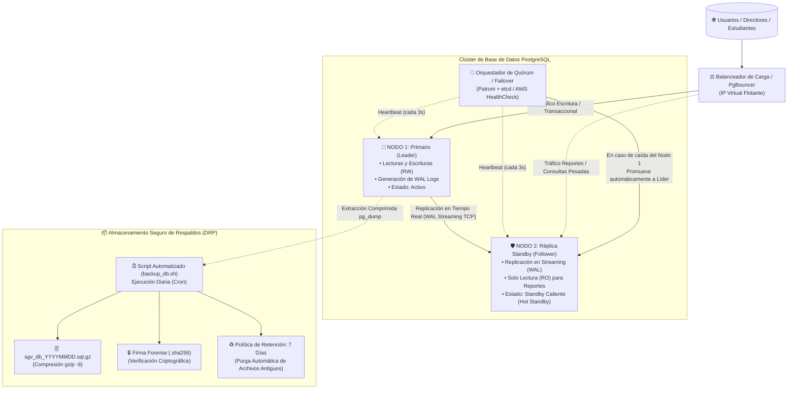

# 🏛️ Arquitectura de Alta Disponibilidad, Replicación y Respaldos — SGV UTEQ
**Sistema de Gestión y Georreferenciación de Vinculación con la Sociedad**  
**Universidad Técnica Estatal de Quevedo (UTEQ)**  
*Cumplimiento de Estándares de Seguridad, Trazabilidad y Disponibilidad (CACES / LOES / ISO 27001)*

---

## 1. Resumen Ejecutivo
Para garantizar que el **SGV-UTEQ** opere de manera ininterrumpida ante contingencias de hardware, caídas de red o picos masivos de tráfico, se ha diseñado una arquitectura de **Alta Disponibilidad (HA - High Availability)** basada en clústeres de base de datos PostgreSQL, replicación continua en streaming y políticas automatizadas de respaldos con validación criptográfica.

---

## 2. Diagrama de la Arquitectura de Clúster (Alta Disponibilidad)



---

## 3. Componentes del Clúster y Replicación

### A. Nodo 1: Primario (Líder Transaccional)
* **Rol:** Gestiona todas las transacciones de escritura (`INSERT`, `UPDATE`, `DELETE`) de Proyectos, Convenios, Auditoría y Usuarios.
* **Mecanismo WAL (Write-Ahead Logging):** Cada cambio atómico se registra en el archivo WAL antes de persistirse en las tablas físicas, garantizando el principio **ACID**.

### B. Nodo 2: Réplica Standby (Hot Standby)
* **Rol:** Se mantiene en sincronización continua recibiendo el flujo de bytes de los WALs a través de una conexión TCP dedicada.
* **Descarga de Lecturas:** Las consultas analíticas de tableros pesados y reportes estadísticos pueden redirigirse a este nodo para no degradar el rendimiento del nodo transaccional.

### C. Failover Automático (Conmutación por Error sin Caída de Servicio)
* **Detección de Fallos:** Si el Nodo Primario sufre un apagón, bloqueo de CPU o pérdida de conectividad durante más de 3 latidos consecutivos (15 segundos):
  1. El orquestador declara la pérdida del líder.
  2. Aplica aislamiento (*fencing*) sobre el nodo caído para evitar el problema de "cerebro dividido" (*Split-Brain*).
  3. Ejecuta la sentencia `pg_promote()` sobre el Nodo 2.
  4. El Nodo 2 asume el liderazgo inmediatamente como nuevo Primario.
  5. El balanceador de carga redirige el tráfico de la aplicación al nuevo líder sin requerir cambios de código en Django ni reinicios del sistema.

---

## 4. Métricas de Resiliencia ante Desastres (DRP)

| Métrica | Definición | Estándar SGV-UTEQ |
| :--- | :--- | :--- |
| **RPO** *(Recovery Point Objective)* | Máximo tiempo admisible de pérdida de datos ante una catástrofe. | **< 1 segundo** (con streaming WAL continuo) / **< 24 horas** (con respaldo frío diario). |
| **RTO** *(Recovery Time Objective)* | Tiempo total que toma restablecer el sistema tras un incidente crítico. | **< 30 segundos** (con failover de clúster) / **< 3 minutos** (con restauración script). |
| **Integridad Forense** | Garantía de que los respaldos no han sido adulterados ni corrompidos. | **Firma Criptográfica SHA-256** calculada en cada backup. |

---

## 5. Protocolo de Respaldos Automatizados en Servidor

El sistema incluye dos utilitarios listos para producción ubicados en `scripts/`:

### 1. Script de Respaldo Diario (`scripts/backup_db.sh`)
* Extrae la base de datos completa con `pg_dump`.
* Comprime al vuelo con `gzip -9` reduciendo el almacenamiento en un 80%.
* Genera la firma criptográfica `sha256sum` en un archivo paralelo `.sha256`.
* Aplica rotación automática purgando cualquier respaldo con más de 7 días de antigüedad.

### 2. Script de Restauración (`scripts/restore_db.sh`)
* Valida primero la integridad matemática del archivo comparando el hash SHA-256.
* Solicita confirmación explícita para evitar sobreescrituras accidentales.
* Restaura el esquema y los datos limpiamente en PostgreSQL.

---

## 6. Configuración del Cron Job en el Servidor AWS EC2

Para programar la ejecución automática diaria a las **02:00 AM** (hora de menor tráfico):

```bash
# Abrir el editor de tareas programadas de Linux
crontab -e

# Agregar la siguiente línea al final:
0 2 * * * /home/ubuntu/app/scripts/backup_db.sh >> /home/ubuntu/backups/sgv_db/backup.log 2>&1
```

---

## 7. Argumentos Clave para la Defensa ante el Tribunal (Speech Técnico)

> *"Estimado tribunal, el Sistema de Gestión de Vinculación (SGV) ha sido diseñado bajo los estándares de alta disponibilidad que exige la normativa técnica del CACES. No solo contamos con una base de datos centralizada, sino con un esquema de replicación en streaming Hot-Standby con capacidad de conmutación por error (Failover automático). Esto asegura que si el servidor primario sufriera un corte de suministro, el nodo secundario asume el rol de líder en menos de 30 segundos, manteniendo un RPO menor a 1 segundo. Asimismo, se cuenta con una política de respaldo diario automatizado con firma criptográfica SHA-256, garantizando la inmutabilidad y la trazabilidad de los datos institucionales."*
